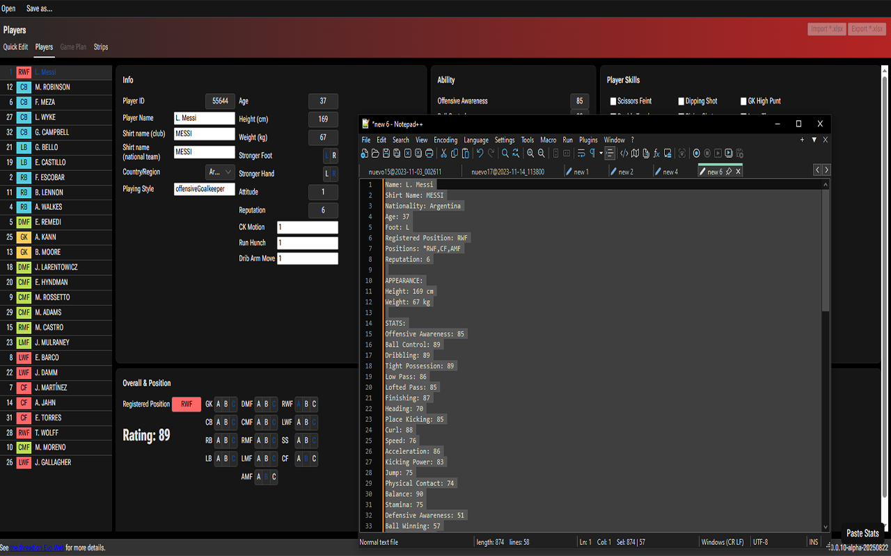

# PES Stats Paste Add-on (Content Script)

This project is a **userscript / content script** in pure JavaScript that adds a floating “**Paste Stats**” button to the site UI (only when the **Players** tab is active) and automatically fills in player data from PES-style clipboard text.

> **Stack**: Plain JavaScript (no React/TS), DOM APIs, React-compatible input/change events.

.

---

## ✨ Features

- Detects when you are on the **Players** section/tab and shows a floating **Paste Stats** button.
- Reads **clipboard text** (`navigator.clipboard.readText()`), parses it, and fills:
  - **Info**: player name, shirt name (club/national), age, country/region, foot, reputation, height/weight, etc.
  - **Overall & Position**: registered position + set all radios to default value, then override based on player positions (A/B/C).
  - **Ability**: numeric stats.
  - **Player Skills** and **COM Playing Styles**: check/uncheck boxes by label text.
- Works with **React controlled inputs** by using native setters and firing `input`/`change` events.

---

## 📋 Expected Input Format (example)

The parser accepts a block of text like this in your clipboard:

```
Name: L. Messi
Shirt Name: MESSI
Nationality: Argentina
Age: 37
Foot: L
Registered Position: RWF
Positions: *RWF,CF,AMF
Reputation: 6

APPEARANCE:
Height: 169 cm
Weight: 67 kg

STATS:
Offensive Awareness: 85
Ball Control: 89
Dribbling: 89
Tight Possession: 89
Low Pass: 86
Lofted Pass: 85
Finishing: 87
Heading: 70
Place Kicking: 85
Curl: 88
Speed: 76
Acceleration: 86
Kicking Power: 83
Jump: 75
Physical Contact: 74
Balance: 90
Stamina: 75
Defensive Awareness: 51
Ball Winning: 57
Aggression: 62
GK Awareness: 40
GK Catching: 40
GK Clearing: 40
GK Reflexes: 40
GK Reach: 40
Weak Foot Usage: 2
Weak Foot Accuracy: 3
Conditioning: 4
Injury Resistance: 2

CARD PLAYER SKILL:
*Long Range Drive
*One-touch Pass
*Outside Curler
*Through Passing

CARD STYLE COM:
*Early Cross
*Long Ball Expert
*Mazing Run

PLAYING STYLE:
Creative Playmaker
```

- `Positions`: entries prefixed with `*` are treated as **A**, without prefix as **B**.
- `CARD PLAYER SKILL` and `CARD STYLE COM`: converted into objects `{ name: true }`.

---

## 🧩 Installation as Extension

### Chrome / Edge

1. Download and extract the .zip from https://github.com/moth1995/pes_stats_paste_addon/releases/latest.
2. Open `chrome://extensions` ➜ enable **Developer mode**.
3. Click **Load unpacked** ➜ select your folder.
4. Open the target site and reload.


### Firefox

1. Download and extract the .zip from https://github.com/moth1995/pes_stats_paste_addon/releases/latest.
2. Go to `about:debugging#/runtime/this-firefox`.
3. Click **Load Temporary Add-on…** and pick `manifest.json`.
4. Reload the target site.

---

## ▶️ Usage

1. Navigate to the **Players** tab on the TEditor app website.
2. Copy player data text into the **clipboard**.
3. Click **Paste Stats** (floating button bottom-right).
4. Done!


> The button only appears if the **Players** tab is active (detected by text “Players” + active class).

---

## 🩹 Troubleshooting

> If by any chance you're not able to use this extension or something is not working properly, please press F12 make a screenshot and open an issue, or report it on evoweb

---

## 🧱 Permissions

- `clipboardRead` allows clipboard access with user interaction (Chrome).
- `host_permissions` restrict script execution to specified domains.

---

## 📄 License

[MIT](LICENSE).

---

## 🤝 Contributing

PRs and issues welcome. Include HTML snippets if labels/structure differ in your build.
